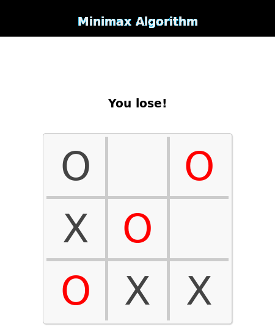

# IA-Jogo Da Velha

Projeto IA, implementação do algoritmo Minimax. O conceito de uma árvore de jogos seguida do algoritmo minimax jogador vs maquina.

## Preview 

	</img>

## Introdução
Para resolver jogos usando IA, apresentaremos o conceito de uma árvore de jogos seguida do algoritmo minimax.
Os diferentes estados do jogo são representados por nós na árvore do jogo, muito semelhantes aos problemas de 
planejamento acima. A ideia é um pouco diferente. Na árvore do jogo, os nós são organizados em níveis que 
correspondem aos turnos de cada jogador no jogo, de forma que o nó “raiz” da árvore (geralmente representado 
no topo do diagrama) seja a posição inicial do jogo. No jogo da velha, esta seria a grade vazia sem Xs ou Os 
jogados ainda. Na raiz, no segundo nível, estão os estados possíveis que podem resultar dos movimentos do primeiro 
jogador, sejam X ou O. Chamamos esses nós de “filhos” do nó raiz.

Cada nó no segundo nível teria ainda como nós filhos os estados que podem ser alcançados a partir dele pelos 
movimentos do jogador adversário. Isso é continuado, nível por nível, até atingir os estados em que o jogo acabou.
No jogo da velha, isso significa que qualquer um dos jogadores obtém uma linha de três e vence, ou o tabuleiro está 
cheio e o jogo termina em empate.

## O que é Minimax?
Minimax é uma inteligência artificial aplicada em jogos de dois jogadores, como jogo da velha, damas, xadrez e jogue.
Esses jogos são conhecidos como jogos de soma zero, porque em uma representação matemática: um jogador ganha (+1) 
e outro jogador perde (-1) ou ambos para não ganhar (0).

## Como isso funciona?
O algoritmo busca, recursivamente, a melhor jogada que leva o jogador * Max * a ganhar ou não perder (empate). 
Ele considera o estado atual do jogo e os movimentos disponíveis naquele estado, então para cada movimento 
válido que ele joga (alternando * min * e * max *) até encontrar um estado terminal (ganhar, empatar ou perder).

## Compreendendo o algoritmo
O algoritmo foi estudado pelo livro Algorithms in a Nutshell (George Heineman; Gary Pollice; Stanley Selkow, 2009).
Pseudocódigo (adaptado):
